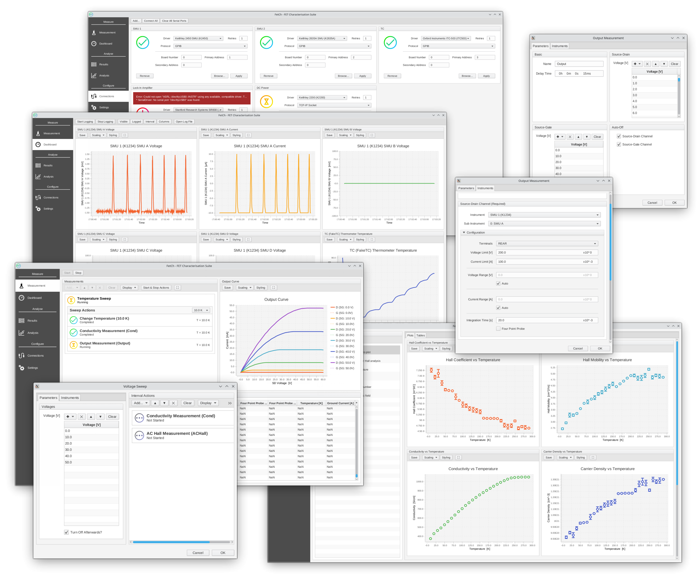
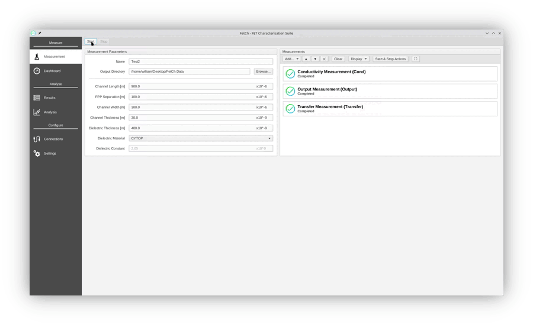
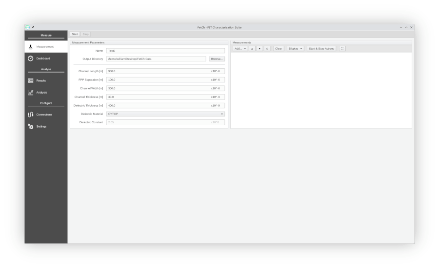
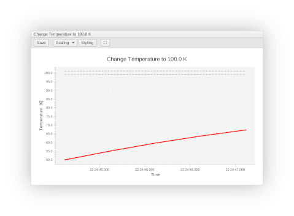
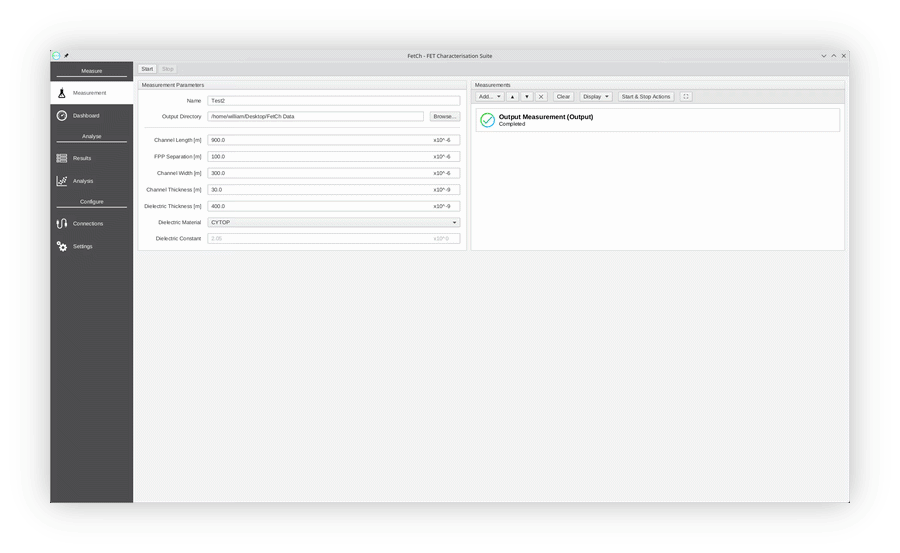
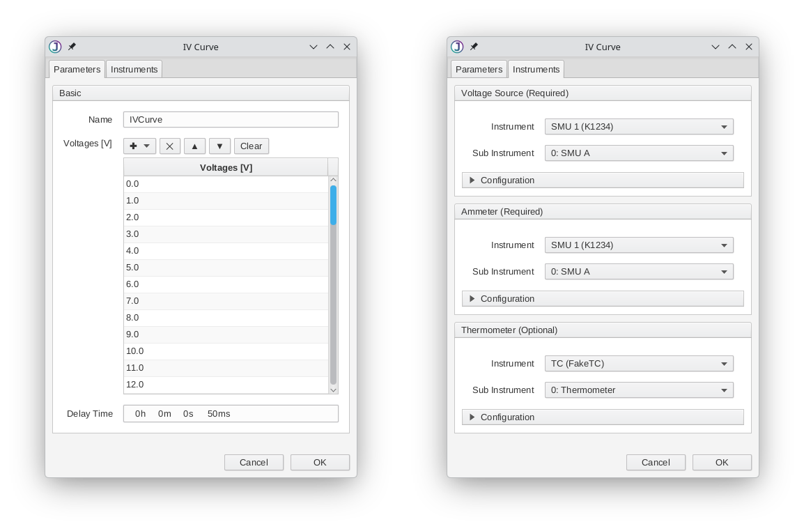

<h1 align="center"><br/>FetCh - FET Characterisation Suite</h1>

<p align="center">
  <a href="fetchExpose.png">
      
  </a>
</p>

Measurement suite for common FET and other electrical measurements, based on the [JISA](https://github.com/OE-FET/JISA) library.

## *Fetching* and Running FetCh

1. Make sure you have Java 11 or newer ([download](https://adoptium.net/en-GB/temurin/releases/?version=11))
2. Download the executable jar file: [FetCh.jar](https://github.com/OE-FET/FETTER/raw/master/FetCh.jar)
3. Run the jar file (you should just need to double-click it)

## Features

### Action Queue

Queue up measurements and actions to automatically run one after the other, allowing you to fully customise your measurement routine

<p align="center">
    
</p>

### Sweeps

Automatically generate queue actions by using a sweep. Just specify the sweep points and what actions to undertake at each point. For instance, with a temperature sweep:

<p align="center">
    
</p>

### Live Plotting

Measurement data is plotted live as it comes in

<p align="center">
    
</p>

### Automatic Analysis

FetCh can take all results currently loaded and automatically determine how best to analyse them and plot the results

<p align="center">
    
</p>

### Extensible

Easily extend FetCh to run your own measurement routines by using the simple-to-understand Kotlin measurement framework
defined by FetCh. Define new functionality and have FetCh generate the GUI for you around it, no GUI-programming experience
required.

<p align="center">
    
</p>

```kotlin
class IVCurve : FetChMeasurement("IV Curve") {

    // Define instruments needed for measurement
    val voltSource  by requiredInstrument("Voltage Source", VSource::class)
    val currMeter   by requiredInstrument("Ammeter", IMeter::class)
    val thermometer by optionalInstrument("Thermometer", TMeter::class)

    // Define user input parameters that FetCh should ask for
    val voltages by userInput("Voltages [V]", Range.linear(0, 60))
    val delay    by userTimeInput("Delay Time", 50)

    // Define columns of data table
    companion object : Columns() {
        val VOLTAGE     = decimalColumn("Voltage", "V")
        val CURRENT     = decimalColumn("Current", "A")
        val TEMPERATURE = decimalColumn("Temperature", "K")
    }
    
    // Measurement routine goes in here
    override fun run(results: ResultTable) {

        // Turn everything on
        voltSource.isOn   = true
        currMeter.isOn    = true
        thermometer?.isOn = true  // "?" means ignore if not set

        // Sweep over voltages, measuring current after delay each time
        for (voltage in voltages) {

            voltSource.voltage = voltage

            sleep(delay)
            
            results.mapRow(
                VOLTAGE     to voltage,
                CURRENT     to currMeter.current,
                TEMPERATURE to (thermometer?.temperature ?: Double.NaN), // Records "NaN" if no thermometer
            )

        }

    }

    // Cleanup when done
    override fun onFinish() {
        voltSource.isOn   = false
        currMeter.isOn    = false
        thermometer?.isOn = false
    }
    
}
```